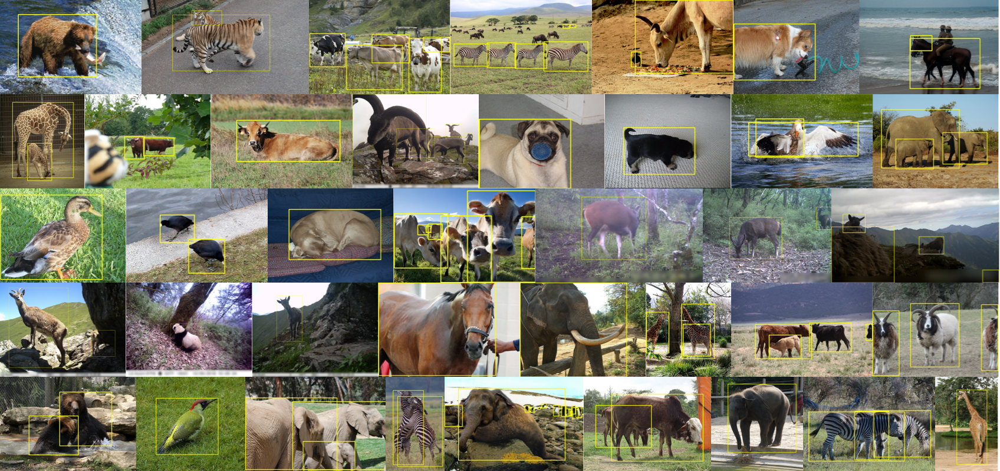

    <h1>
        AOD Dataset
    </h1>

## Introduction
The AOD (Animal Object Detection) dataset is a large-scale animal image dataset specifically designed for object detection tasks. It integrates animal images and bounding box annotations from five publicly available datasets. These datasets encompass both animal-focused datasets and general datasets covering a wide range of scenes.

Our dataset encompasses data from 18 different animal species, including livestock and wildlife. You can find a complete list of categories in [categories.yaml](https://github.com/islgl/AOD-dataset/blob/main/categories.yaml). It comprises a total of 35,054 images and 81,078 annotated bounding boxes, capturing scenes ranging from everyday life to zoos and wildlife environments.

    

The dataset is organized in the YOLO data format, with each image having a corresponding `.txt` file containing bounding box annotations. For detailed information on YOLO data format, please refer to the [Ultralytics YOLOv5 documentation](https://docs.ultralytics.com/yolov5/tutorials/train_custom_data/#:~:text=download%20your%20dataset.-,Option%202%3A%20Create%20a%20Manual%20Dataset,-2.1%20Create%20dataset).

    

## Download
You can download the whole dataset from [Google Drive](https://drive.google.com/drive/folders/10qifTMvSSYeQLRCS9b650fMlthQCy9Mu?usp=sharing) or [OneDrive](https://yqsyw-my.sharepoint.com/:f:/g/personal/hi_lglgl_cc/EjEh8D0AuBVEsBVwe6fkbdcBKRCSZ7H65rtjhWZl1RK8SQ?e=T35lOi).

| Set   | Images | Instances |
| ----- | ------ | --------- |
| Train | 28,051 | 64,834    |
| Val   | 7,003  | 16,244    |

### AOD-Rare
In addition, we also provide the **AOD-Rare (AODR)** dataset. This dataset, built upon the complete AOD dataset, includes data for 10 rare animals. AODR comprises over 55,000 images and more than 110,000 instances. You can download the AODR dataset from [OneDrive](https://yqsyw-my.sharepoint.com/:u:/g/personal/hi_lglgl_cc/EeWrFUDf2LpBq2reLArjWA0BUs261zwHyxdNm8_PSIo-pQ?e=MTEVOs).

## Acknowledgement
All data in the AOD dataset is sourced from five public datasets, including well-known and widely used datasets such as [Pascal VOC 2012](http://host.robots.ox.ac.uk/pascal/VOC/voc2012/) and [MS COCO 2017](https://cocodataset.org/#home). Additionally, the AOD dataset includes data from three animal-focused public datasets, namely [Animal Pose](https://sites.google.com/view/animal-pose/) by [Jinkun Cao](mailto:jinkuncao@gmail.com) and others, [LoTE-Animal](https://lote-animal.github.io/) by Dan Liu and others, as well as [ATRW (Amur Tiger Re-identification in the Wild)](https://cvwc2019.github.io/challenge.html) from CVWC 2019. **We express sincere gratitude to the contributors of these datasets.**

## Copyright
This dataset is licensed under the [CC BY 4.0](https://creativecommons.org/licenses/by/4.0/) license. Refer to the [LICENSE](https://github.com/islgl/AOD-dataset/blob/main/LICENSE) file for details.

